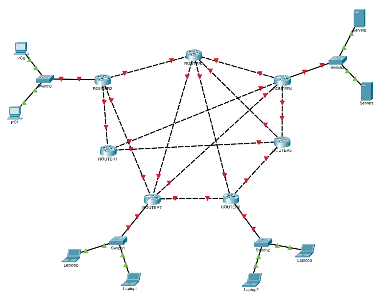
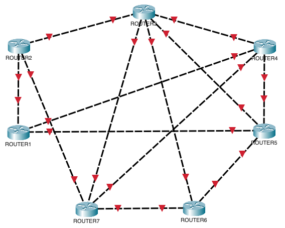

# networking
## Default network

---

## Date de intrare
| Ruta  | Latenta $(T)$ | Productivitatea $(P)$ | $P$, $BW = 100GB$s |
| ----- | ------------- | --------------------- | ------------------ |
| R1-R2 | 11s           | $\dfrac{6}{13}BW$     | 46GBs              |
| R1-R4 | 3s            | $\dfrac{1}{2}BW$      | 50GBs              |
| R1-R5 | 8s            | $\dfrac{3}{10}BW$     | 30GBs              |
| R2-R3 | 1s            | $\dfrac{6}{7}BW$      | 86GBs              |
| R2-R7 | 1s            | $\dfrac{7}{10}BW$     | 70GBs              |
| R3-R4 | 9s            | $\dfrac{8}{15}BW$     | 53GBs              |
| R3-R5 | 3s            | $\dfrac{7}{8}BW$      | 87GBs              |
| R3-R6 | 9s            | $\dfrac{8}{11}BW$     | 73GBs              |
| R3-R7 | 6s            | $\dfrac{1}{2}BW$      | 50GBs              |
| R4-R5 | 11s           | $\dfrac{7}{11}BW$     | 64GBs              |
| R4-R7 | 2s            | $\dfrac{4}{9}BW$      | 44GBs              |
| R5-R6 | 12s           | $\dfrac{2}{5}BW$      | 40GBs              |
| R6-R7 | 2s            | $\dfrac{7}{12}BW$     | 58GBs              |

---

## Rooters network

