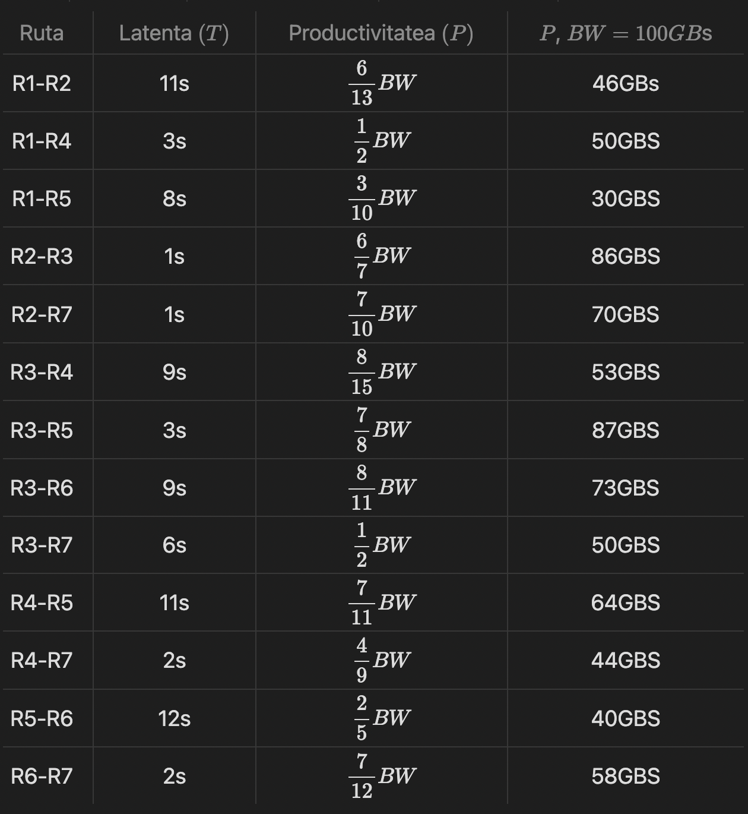
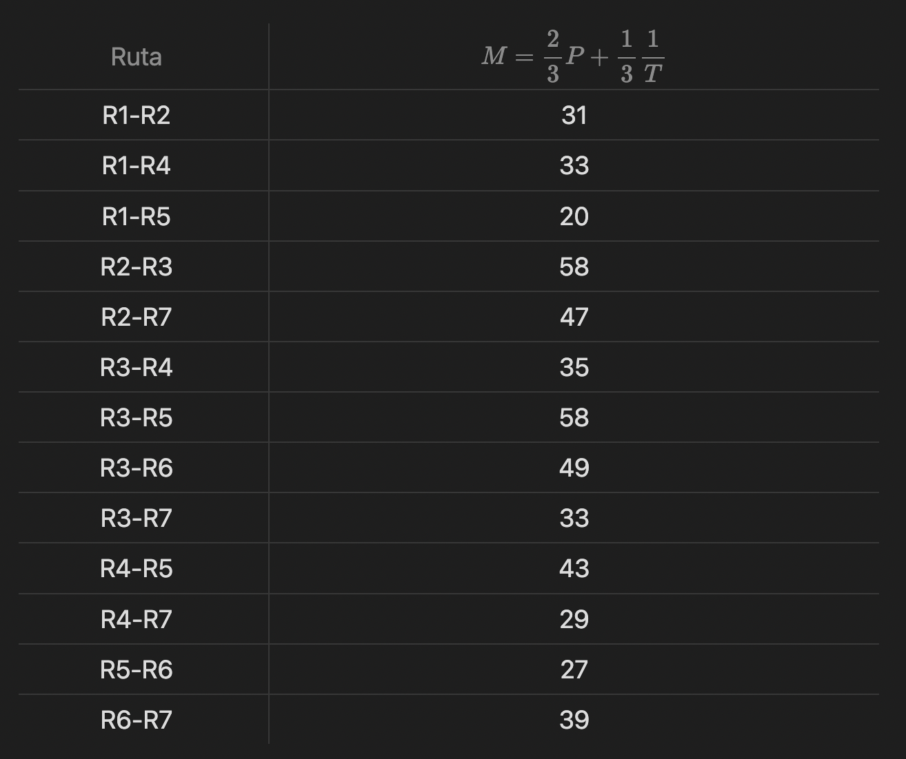
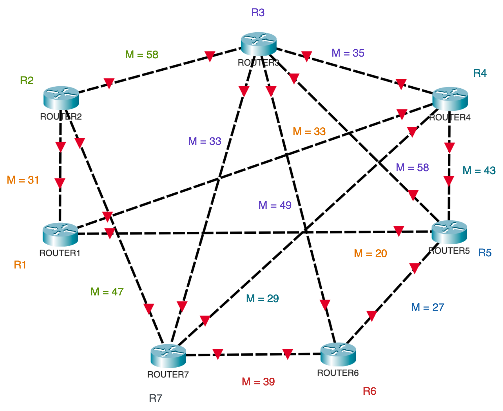
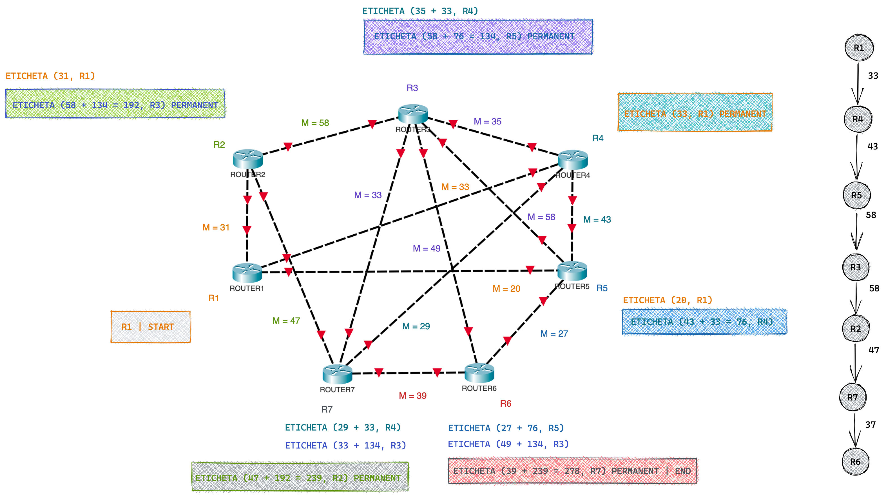
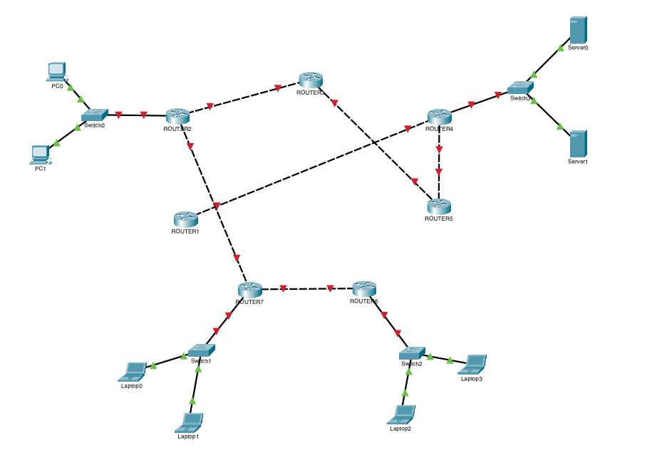
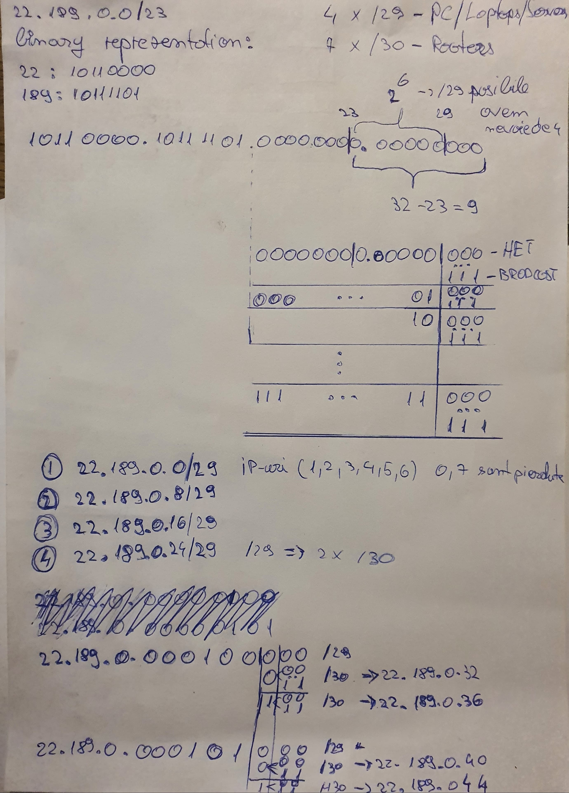
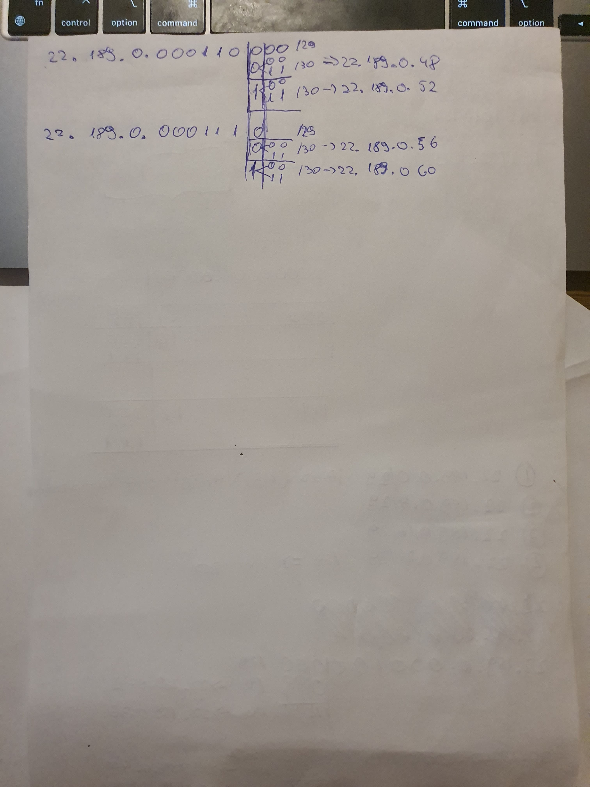

# networking

UMFT Project

# Networks
## Default network

## Rooters network

---

# Input data

# Metrices

---

# Rooters network with metrices added

---

# Tree

---

# Resulted network after permanent tags ar applied

---

# IP calculation
O sa calculez prima data ip-urile pentru 2 hosturi pe retea.

## 2 Hosts

---

## Multiple hosts